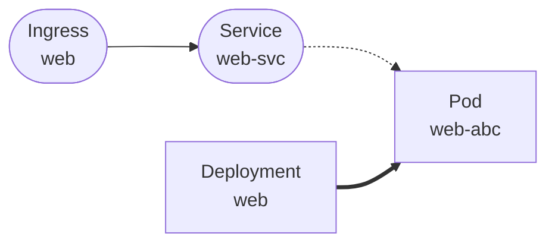

# kubectl-graph

`kubectl-graph` is a Kubernetes plugin that helps you quickly understand workload and network relationships from the command line.

It provides a dependency-oriented view so you can inspect how resources connect without chaining multiple `kubectl get ...` commands.

## What It Shows

Depending on the command, the graph can include:

- Ingress -> Service
- Service -> Pod
- Workload controller -> Pod (`Deployment`, `StatefulSet`, `DaemonSet`, `Job`, `CronJob`, `ReplicaSet`)
- Pod -> PVC -> PV (storage dependencies)

## Output Formats

Supported output modes:

- `ascii` (default)
- `tree`
- `mermaid`
- `json`

## Requirements

- Go 1.26+ to build from source
- Access to a Kubernetes cluster through your current kubeconfig context
- Kubernetes 1.35 to 1.37 (minimum and maximum supported versions)
- Read permissions (RBAC) for the resources you query (`ingresses`, `services`, `pods`, `deployments`, `replicasets`, `persistentvolumeclaims`, `persistentvolumes`, and related APIs)

## Install a Prebuilt Release

Download the archive matching your operating system and architecture from [GitHub Releases](https://github.com/chayte/kgraph/releases/latest). Archives are named `kubectl-graph_<version>_<os>_<architecture>`; Windows releases use `.zip`, and macOS and Linux releases use `.tar.gz`.

For macOS or Linux, extract the archive, install the executable in `~/.local/bin`, and make sure that directory is in your `PATH`. For example, with the Linux amd64 release `v0.1.0`:

```bash
tar -xzf kubectl-graph_v0.1.0_linux_amd64.tar.gz
mkdir -p ~/.local/bin
install -m 0755 kubectl-graph_v0.1.0_linux_amd64/kubectl-graph ~/.local/bin/kubectl-graph
export PATH="$HOME/.local/bin:$PATH"
```

For Windows, extract the `.zip` archive and add the directory containing `kubectl-graph.exe` to your `PATH`.

Each release archive includes this project's license, third-party license texts, and a CSV license report. `SHA256SUMS` is available on the release page to verify downloaded archives.

To publish a release, push a version tag such as `v0.1.0`:

```bash
git tag v0.1.0
git push origin v0.1.0
```

GitHub Actions then builds the release archives and attaches them to the GitHub Release for that tag.

## Build

```bash
go mod tidy
go build -o bin/kubectl-graph ./cmd/kubectl-graph
```

## Install as a kubectl Plugin

`kubectl` automatically discovers executables named `kubectl-*` in your `PATH`.

Example:

```bash
mkdir -p ~/.local/bin
cp bin/kubectl-graph ~/.local/bin/
export PATH="$HOME/.local/bin:$PATH"
```

## Usage

```bash
kubectl graph ingress <name> -n <namespace>
kubectl graph service <name> -n <namespace>
kubectl graph deployment <name> -n <namespace>
kubectl graph deploy <name> -n <namespace>
kubectl graph job <name> -n <namespace>
kubectl graph cronjob <name> -n <namespace>
kubectl graph cron <name> -n <namespace>
kubectl graph pvc <name> -n <namespace>

kubectl graph ingress <name> -n <namespace> --output ascii
kubectl graph ingress <name> -n <namespace> --output tree
kubectl graph ingress <name> -n <namespace> --output mermaid
kubectl graph ingress <name> -n <namespace> --output json
```

`-n/--namespace` can be placed before or after the resource name.

## ASCII View Notes

The `ascii` mode is optimized for terminal readability and includes key metadata such as:

- routes (`host`, `path`, backend target)
- service properties (`type`, `ClusterIP`, ports)
- endpoint and pod details (`IP`, `phase`, container ports, owner)
- PVC/PV details for storage queries

Values are styled with ANSI bold for readability.
To disable styling:

```bash
NO_COLOR=1 kubectl graph ...
```

## Shell Completion

### zsh

```bash
kubectl-graph completion zsh > ~/.kubectl-graph-completion.zsh
echo 'source "$HOME/.kubectl-graph-completion.zsh"' >> ~/.zshrc
source ~/.zshrc
```

### bash

```bash
kubectl-graph completion bash > ~/.kubectl-graph-completion.bash
echo 'source "$HOME/.kubectl-graph-completion.bash"' >> ~/.bashrc
source ~/.bashrc
```

Completion supports both forms:

- `kubectl-graph ...`
- `kubectl graph ...`

## Mermaid Example



## Current Scope

- Namespace-scoped queries (single namespace at a time)
- Read-only graph reconstruction from Kubernetes APIs
- Designed for quick operational visibility in CLI workflows

## Design Choice

The plugin reads from Kubernetes APIs (like `kubectl`) rather than directly from etcd. This keeps it:

- portable
- RBAC-compatible
- stable across Kubernetes environments

## License

This project is licensed under the Apache License 2.0. See [LICENSE](LICENSE) for details.
